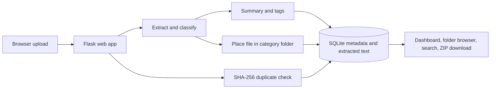

# Sortwise — AI Smart File Organizer
 # Ai lab project By NILAY MONDAL - 2402221530084, Uder the guidance of Ms. ANJALI SRIVASTAVAA Maam.


 
A local-first B.Tech AI Lab project for classifying, summarizing, searching, and organizing files. It includes a Flask web dashboard and a native Tkinter folder organizer. The web app stores uploaded files in category folders on disk and tracks metadata in SQLite.

## Features

- Classifies documents and media using filename and content signals from the existing analyzer.
- Extracts PDF, DOCX, and text content; creates local extractive summaries or optional OpenAI/Gemini summaries.
- Organizes web uploads into physical folders such as `uploads/Financial/Finance/`.
- Browses organized folders and downloads one file or a whole folder as a ZIP.
- Finds exact duplicates with SHA-256 and suggests similar files.
- Searches filenames, tags, extracted text, categories, and summaries. Optional OpenAI embeddings improve semantic retrieval.
- Shows file totals, storage use, categories, topics, recent uploads, and duplicate suggestions.
- Provides a desktop UI to select a source folder and destination, preview with Dry Run, and copy or move files with progress reporting.

## Project structure

```text
file organiser/
├── web_app.py                 # Flask routes, upload processing, folder ZIP downloads
├── database.py                # SQLite schema and persistence
├── ai_service.py              # Text extraction, classification, summaries, optional APIs
├── search_service.py          # Local text retrieval and similar-file suggestions
├── content_analyzer.py        # Existing content analyzer
├── file_type_detector.py      # Existing file-type detection
├── file_organizer.py          # Existing folder classification and file operations
├── organizer_ui.py            # Tkinter desktop application
├── final_system.py             # Unified CLI and desktop UI entry point
├── phase9_evaluation.py        # Evaluation workflow
├── templates/index.html        # Web dashboard
├── static/app.js, style.css    # Web client and responsive styling
├── sample_dataset/             # Small sample text documents
├── uploads/                    # Web uploads, organized into category folders
└── instance/files.db           # SQLite metadata database
```

`uploads/` and `instance/files.db` are local runtime data. Keep backups if you need to retain uploaded files or their analysis records.

## Install

Python 3.10 or newer is recommended. From Terminal, change to this project directory, then create and install the environment:

```bash
python3 -m venv .venv
.venv/bin/python -m pip install --upgrade pip
.venv/bin/python -m pip install -r requirements.txt
```

On Windows, activate with `.venv\\Scripts\\activate` and use `python` instead of `.venv/bin/python`.

## Run the web app

```bash
MAX_UPLOAD_MB=500 .venv/bin/python web_app.py
```

Open [http://127.0.0.1:5000](http://127.0.0.1:5000). The app binds to localhost by default, so it is available only on this computer. The default upload cap is 50 MB; `MAX_UPLOAD_MB=500` raises it to 500 MB for this run.

In **My files**, select a category folder to filter its contents. **Download folder (.zip)** downloads every file in that folder together. Individual **Download** buttons are also available. Folder ZIPs are saved by the browser to its normal download location.

The web app accepts PDF, DOCX, TXT, Markdown, CSV, JSON, common image/video/audio formats, and ZIP. Document summaries are generated for PDF, DOCX, and TXT. Existing library uploads are moved into their recorded category folders the next time the app starts.

To stop the web app, return to its Terminal window and press **Ctrl+C**.

## Run the desktop folder organizer

From the project directory:

```bash
.venv/bin/python final_system.py ui
```

Choose a source folder and destination in the desktop window, then click **Start Organizing**. **Dry Run** previews changes without copying or moving files. By default, the organizer copies files; check **Move Files** to move originals. The progress bar reports completed files.

## Optional hosted AI providers

The app works without API keys: summaries use a local extractive fallback and search uses local token similarity. Install only the provider SDK you want:

```bash
.venv/bin/python -m pip install -r requirements-openai.txt
# or
.venv/bin/python -m pip install -r requirements-gemini.txt
```

For hosted summaries, set `SUMMARY_PROVIDER=openai` with `OPENAI_API_KEY`, or `SUMMARY_PROVIDER=gemini` with `GEMINI_API_KEY`. OpenAI embeddings can be enabled with `SEARCH_PROVIDER=openai` and `OPENAI_API_KEY`. Hosted AI sends document text to that provider; use the local fallback for private files.

## Architecture and workflow



The desktop path uses the same content analyzer and organizer, but selects files from a local source directory instead of uploading them through a browser.

## Database schema

The `files` table stores:

| Column | Purpose |
| --- | --- |
| `id` | Record identifier |
| `original_name`, `stored_path` | Original filename and current local path |
| `category`, `content_category`, `folder` | Classification and destination folder label |
| `summary`, `extracted_text` | Summary and extracted document text |
| `uploaded_at`, `size_bytes` | UTC upload time and file size |
| `sha256`, `duplicate_of` | Exact duplicate fingerprint and optional matching record |
| `tags`, `topics`, `embedding` | JSON AI tags, detected topics, and optional embedding |

Indexes cover upload time, SHA-256, and category.

## Existing CLI and demo

The unified command-line tool also supports detection, analysis, organization, undo, evaluation, and a sample demonstration. See [FINAL_DEMO_GUIDE.md](FINAL_DEMO_GUIDE.md) and [PHASE9_TESTING.md](PHASE9_TESTING.md).

Run the sample demonstration with:

```bash
.venv/bin/python final_system.py demo --demo-root final_demo --generate-sample --clean --pretty --output-json final_demo/demo_result.json
```

## Security and future scope

This is a local single-user lab project, not a hardened public service. Before network deployment, add authentication, CSRF protection, malware scanning, rate limits, encrypted storage, and a retention/backup policy. Future work could add OCR, audio/video transcription, background processing, user feedback for classifier tuning, and multi-user workspaces.
